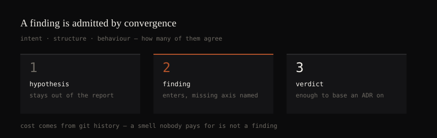

# zodchiy

**An architectural audit where a finding is admissible only once its cost has
been measured.** Not a linter: the cost is not in the import graph, it is in
the git history, and here it is the admission rule rather than a decoration.

[](https://github.com/Socialpranker/zodchiy/actions/workflows/evals.yml)




Every architecture linter can tell you that a module has fan-in 40 or that
there is an import cycle. None can tell you what it costs. A finding that
cannot be priced does not enter the report — that single rule is what makes
the output short enough to act on.

The name is Russian: *зодчий*, a master builder.

## What a run looks like

One command, no model involved, no dependencies to install:

```sh
python3 zodchiy.py measure /path/to/repo --out .zodchiy/measure.json
```

The doctrine then turns that measurement into a report. Opening of a real one,
produced on a repository nobody here maintains:

```markdown
# Audit report — Textualize/rich

**Checklist: 5/6.** Step 6 (artefacts) was not performed: a current-state
document, ADRs and a migration plan belong to the repository's maintainers.
Steps 1–5 were performed in full; step 4 ran in degraded mode, declared below.

| measured | 213 files, 750 edges, 1942 commits with code |
| parser   | tree-sitter on 213 of 213 files, no regex fallback |
```

Every figure in every finding carries the path it came from, and a script
refuses the report if the path does not resolve:

```
source: behavior.hotspots[file=rich/console.py].fix_share
        structure.hubs[file=rich/console.py].fan_in
```

**[`examples/rich/`](examples/rich/) is that run in full** — measurement,
ledger, twelve refutation verdicts, report, SARIF. Read `report.md` first:
the largest number in that measurement, a 50-file dependency cycle, is the one
thing the report refuses to turn into a recommendation, because its cost could
not be established.

## Install

The canonical form is an agent skill. `./install.sh` finds the harnesses
present on the machine and refuses to overwrite anything it did not write.

```sh
git clone https://github.com/Socialpranker/zodchiy && cd zodchiy && ./install.sh
```

Python 3.11+ and `git`. Nothing outside the standard library, by design: a
tool that audits other people's repositories should not add a supply chain to
do it.

```sh
python3 zodchiy.py snapshot .zodchiy/measure.json --out .zodchiy/baseline.json
python3 zodchiy.py gate .zodchiy/measure.json --baseline .zodchiy/baseline.json   # exit 1 on regression
python3 zodchiy.py export --findings .zodchiy/findings.csv --measure .zodchiy/measure.json --format sarif
```

## Three axes

| Axis | Source | Blind to |
|---|---|---|
| **Intent** | ADR, README, agent instructions, import-linter / ArchUnit / eslint-boundaries | lies once the docs fall behind the code |
| **Structure** | `scripts/structure.py` — import graph, cycles, fan-in/out, complexity | DI, registries, reflection, string keys |
| **Behaviour** | `scripts/behavior.py` — churn, fix share, co-change, ownership | code that has not changed yet |

A structural smell nobody ever pays for is not a finding here. Neither is a
painful file with no structural cause — that one is a staffing problem.

## What is verified, and what is not

The rule this tool applies to other people's code applies to its own claims.

**Verified.**

- 171 unit tests, green
- 14 frozen end-to-end cases against ground truth, each `dirty` case
  paired with a `clean` one — without the pair, "found N" cannot be told apart
  from "found N plus ten false ones" (method borrowed from OWASP Benchmark)
- degenerate repositories: no commits, one commit, non-UTF-8 file, detached
  HEAD, not a git repository at all. Each must answer with an explicit field,
  not a traceback
- the test harness itself, by mutation: it goes red when it should
- the one live run over a foreign repository is held as a regression, not kept
  as an illustration: paths resolve, every finding passed step 4 and reached
  both the report and the exports
- the skill's own `description`, against a catalogue of twelve competing tools
  over 20 cases, half of them phrased without the words
  "architecture" or "tech debt". Split train/test, edited on `train` only.
  After the edit: `test` recall 0.83, false positives
  0.25 — the price of widening it, stated rather than hidden

**Not verified**, stated plainly because a tool that hides its own gaps has no
business auditing yours.

- **no adapter has ever been run inside its target harness.** Built is not working
- the trigger evaluation ran once; variance between repeats is unmeasured. Its
  off-domain control failed outright: swap the description for one about code
  formatting and three of four architectural requests still land here. The
  floor is set by the catalogue and by the skill's name — what the description
  demonstrably moves is 6 cases out of 20
- step 4, the refutation pass, has never run end to end with independent
  lenses — only the mechanics of recording its verdict are covered
- `recon` mode has never been run
- thresholds were calibrated on two repositories and will drift on a third.
  Percentiles travel between projects; absolute numbers do not — CALIBRATION.md

## How the audit runs

Six steps. The first is a script; the rest are a doctrine an agent executes,
and each has something mechanical holding it honest.

1. **Measure.** Cycles (type-only ones kept apart — they exist to break
   cycles), hubs and fan-in through barrels, per-function complexity, temporal
   coupling, hotspots by fix share, change spread, rework within days,
   ownership. Every absolute number arrives with its percentile, and the
   calibration — blocked metrics, regex fallbacks, history window — is part of
   the output rather than a footnote.
2. **Map, without verdicts.** The tops of the rankings, never the tree of
   directory names; every claim marked `OBSERVED`, `INFERRED` or `UNKNOWN`.
   A verdict issued before the map drags the whole analysis behind it.
3. **Judge.** A risk catalogue (R1–R6) behind a materiality gate, Pain ×
   Spread. Each entry carries its own *what not to flag*: a composition root
   with high fan-out is a design, not a mess.
4. **Refute.** Every high-priority finding is attacked through four lenses.
   What survives is marked as surviving; what does not is dropped, not
   softened. Without subagents the lenses run sequentially — and then
   confidence is capped and the degradation is printed in the report.
5. **Report.** Opens with `Checklist: X/Y`, closes with blind spots assembled
   mechanically: blocked metrics, regex-parsed files, the history window, links
   no import graph can see, and how step 4 actually ran. Silently truncating a
   top-N list is forbidden — say how many were dropped.
6. **Artefacts.** Current-state document, ADRs, migration plan, and a findings
   ledger the next run compares itself against.

Three modes: `audit` (your own repository), `plan` (findings into decisions and
their order), `recon` (a repository you have just been handed).

Every finding must predict a `gain`, and `verify` compares that prediction
against the next measurement. An audit nobody can be wrong about is not an
audit.

## The hard rule

```
Numbers come from a script. Judgement comes from the model. Never the reverse.
No metric is eyeballed — not fan-in, not complexity, not a cycle.
No finding is issued before the full map is built.
```

Prose cannot be told apart from a number recalled from memory; a path can be
checked, and `zodchiy.py selfcheck` refuses a report whose numbers do not
resolve.

## Adapters

One text under four names — each harness looks for a different filename.

| File | Goes to |
|---|---|
| `AGENTS.md` | Codex (`~/.codex/AGENTS.md`, or the repository root), Grok Build, Cursor, Zed |
| `GEMINI.md` | Gemini CLI (`~/.gemini/GEMINI.md`, or the repository root) |
| `QWEN.md` | Qwen Code (`~/.qwen/QWEN.md`) |
| `IFLOW.md` | iFlow CLI (`~/.iflow/IFLOW.md`) |

| Slash command | Goes to |
|---|---|
| `gemini/commands/zodchiy.toml` | `~/.gemini/commands/zodchiy.toml` |
| `iflow/commands/zodchiy.toml` | `~/.iflow/commands/zodchiy.toml` |

Claude Code and Grok Build need no adapter — the whole directory goes to
`~/.claude/skills/zodchiy/` or `~/.grok/skills/zodchiy/`. Adapters are generated
from `SKILL.md` by `scripts/build_adapters.py`; do not edit `dist/` by hand.

## Language

The doctrine — `SKILL.md`, `SPEC.md` and `references/` — is in Russian. It is
read by a model, and models read Russian. Translating 280 KiB would create a
second copy that drifts from the first within a month, which is the exact
failure mode this repository exists to detect. English is the interface:
README, installer, CLI help of the public documents.

## License

MIT. See LICENSE.
